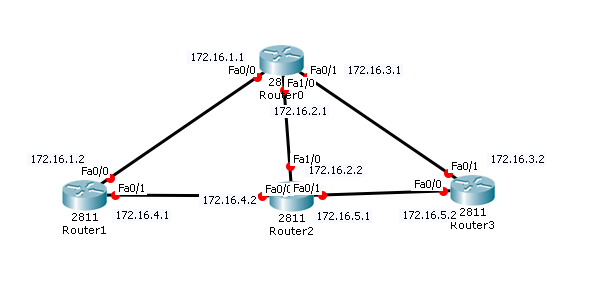

1. #####  路由配置如下，请说明每一步配置的含义

```
router(config)#interface s0/0
router(config-if)#no shutdown
router(confg-if)#clock rate 64000
router(config-if)#ip address 192.168.1.1 255.255.255.0
```

（1）进入s0/0串口的端口配置模式

（2）启用该端口

（3）设置时钟频率为64000

（4）设置路由器该端口的IP地址和子网掩码

2. ##### 路由器Router配置如下，5请说明每一步配置的含义

```
RouterA#configure turminal
RouterA(config)#ip route 192.168.1.0 255.255.255.0 10.0.0.2
RouterA(config)#ip route 0.0.0.0 0.0.0.0 serial0/1
RouterA(config)#exit
RouterA#show ip route
```

（1）进入全局配置模式

（2）配置静态路由到1.0/24子网的包全转发给0.2端口

（3）配置默认路由的转发端口

（4）退出全局配置模式

（5）查看路由表

3. ##### 有如下网络拓扑图，请配置静态路由，并测试网络的连通性



```
Router0>en
Router0#conf t
Router0(config)#int f0/0
Router0(config-if)#ip addr 172.16.1.1 255.255.255.0
Router0(config-if)#no sh
Router0(config-if)#int f0/1 
Router0(config-if)#ip addr 172.16.3.1 255.255.255.0
Router0(config-if)#no sh
Router0(config-if)#int f1/0 
Router0(config-if)#ip addr 172.16.2.1 255.255.255.0
Router0(config-if)#no sh
Router0(config-if)#end
Router0#ip route 172.16.1.0 255.255.255.0 172.16.3.1
Router0#ip route 172.16.1.0 255.255.255.0 172.16.2.1
Router0#ip route 172.16.2.0 255.255.255.0 172.16.1.1
Router0#ip route 172.16.2.0 255.255.255.0 172.16.3.1
Router0#ip route 172.16.3.0 255.255.255.0 172.16.1.1
Router0#ip route 172.16.3.0 255.255.255.0 172.16.2.1

Router1>en
Router1#conf t
Router1(config)#int f0/0
Router1(config-if)#ip addr 172.16.1.2 255.255.255.0
Router1(config-if)#no sh
Router1(config-if)#int f0/1 
Router1(config-if)#ip addr 172.16.4.1 255.255.255.0
Router1(config-if)#no sh
Router1(config-if)#end
Router1#ip route 172.16.3.0 255.255.255.0 172.16.1.1
Router1#ip route 172.16.3.0 255.255.255.0 172.16.4.1
Router1#ip route 172.16.2.0 255.255.255.0 172.16.4.2
Router1#ip route 172.16.5.0 255.255.255.0 172.16.4.2

Router2>en
Router2#conf t
Router2(config)#int f0/0
Router2(config-if)#ip addr 172.16.4.2 255.255.255.0
Router2(config-if)#no sh
Router2(config-if)#int f0/1 
Router2(config-if)#ip addr 172.16.5.1 255.255.255.0
Router2(config-if)#no sh
Router2(config-if)#int f1/0 
Router2(config-if)#ip addr 172.16.2.2 255.255.255.0
Router2(config-if)#no sh
Router2(config-if)#end
Router2#ip route 172.16.1.0 255.255.255.0 172.16.2.1
Router2#ip route 172.16.3.0 255.255.255.0 172.16.2.1
Router2#ip route 172.16.1.0 255.255.255.0 172.16.4.1
Router2#ip route 172.16.3.0 255.255.255.0 172.16.5.1

Router3>en
Router3#conf t
Router3(config)#int f0/0
Router3(config-if)#ip addr 172.16.5.2 255.255.255.0
Router3(config-if)#no sh
Router3(config-if)#int f0/1 
Router3(config-if)#ip addr 172.16.3.2 255.255.255.0
Router3(config-if)#no sh
Router3(config-if)#end
Router3#ip route 172.16.1.0 255.255.255.0 172.16.3.1
Router3#ip route 172.16.1.0 255.255.255.0 172.16.5.1
Router3#ip route 172.16.2.0 255.255.255.0 172.16.3.1
Router3#ip route 172.16.2.0 255.255.255.0 172.16.5.1
Router3#ip route 172.16.4.0 255.255.255.0 172.16.5.1
```

4. ##### 简述OSPF协议的配置步骤及注意事项

- 配置步骤

  （1）开启OSPF进程

  （2）宣告参与OSPF的端口IP

  （3）设定区域

- 注意事项

  （1）network使用反子网掩码

  （2）为保证每个区域有DR和BDR应设置Rout-ID

5. ##### 简述BGP协议提供报文的种类及作用

- Open报文：用于建立BGP对等体连接。
- Update报文：用于在对等体之间交换路由信息。
- Notification报文：用于中断BGP连接。
- Keepalive报文：用于保持BGP连接。
- Route-refresh报文：用于在改变路由策略后请求对等体重新发送路由信息。只有支持路由刷新(Route-refresh)能力的BGP设备会发送和响应此报文。